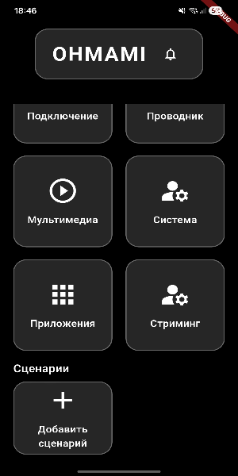

## Навигация по экрану Home

Экран **Home** — главный экран интерфейса OHMAMI, с которого доступен быстрый переход к основным функциям.  
Он объединяет **статус подключения**, *быстрые действия* и компактный обзор состояния подключённого устройства, поэтому именно сюда пользователь возвращается чаще всего.

Ниже пример того, как выглядеть экран:

### Основные области экрана

| Область интерфейса    | Описание                                                                 |
|------------------------|--------------------------------------------------------------------------|
| Статус подключения     | Показывает текущее состояние связи с телефоном и возможные ошибки.      |
| Быстрые действия       | Крупные кнопки для запуска файлового проводника, медиа и стриминга.    |
| Информация об устройстве | Имя телефона, заряд батареи, тип сети, дополнительные индикаторы.    |

### Жесты и управление

Чтобы быстро освоиться с Home, выполни следующие шаги:

1. Нажми на карточку **подключение**, чтобы открыть подробную панель и убедиться, что телефон подключён корректно.
2. Кликни по иконке **«Файлы»**, чтобы перейти в [проводник файлов](file-explorer.md) и проверить доступ к хранилищу устройства.
3. Перейди к разделу **«Медиа»**, чтобы протестировать [управление мультимедиа](media-control.md).
4. Открой модуль **«Стриминг»**, чтобы протестировать [стриминг экрана](streaming.md) и оценить качество связи.

Подробнее об отдельных возможностях см.:
- [Проводник файлов](file-explorer.md)
- [Управление мультимедиа](media-control.md)
- [Система и приложения](system-and-apps.md)
- [Стриминг экрана](streaming.md)

